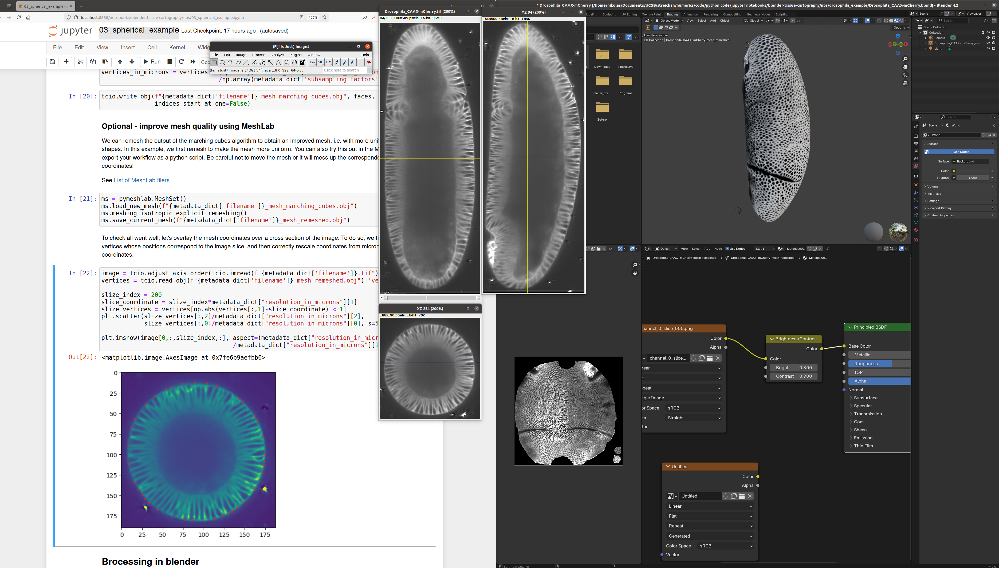

# blender-tissue-cartography

<!-- WARNING: THIS FILE WAS AUTOGENERATED! DO NOT EDIT! -->

## Work in progress!

- Tools for individual recordings are in a reasonably complete state.
- Python mesh operations (remeshing, smoothing, etc) can be carried out
  in `pymeshlab` or `open3d`. User-friendly interfaces for both are
  provided. Core functionality is independent of both `pymeshlab` or
  `open3d`.
- Support for multiple recordings (e.g. frames of a movie with a dynamic
  surface or multiple images of similarly-shaped structures) is in
  progress
  - Done: automated affine registration, manual wrapping
  - In progress: automated wrapping using `open3d`

## Installation

1.  Install required non-python programs: [Fiji](https://fiji.sc/)
    (optional), [Ilastik](https://www.ilastik.org/),
    [Meshlab](https://www.meshlab.net/) (optional), and
    [Blender](https://www.blender.org/).

2.  Install python via
    [anaconda/miniconda](https://docs.anaconda.com/miniconda/miniconda-install/),
    if you haven’t already.

    - If `conda` is unbearably slow for you, install
      [mamba](https://mamba.readthedocs.io/en/latest/index.html), a
      `conda` replacement which is much faster.

3.  Download and unpack `blender-tissue-cartography` (“Code -\> Download
    Zip”), or clone the github repository.

4.  Create a `conda` environment with all python dependencies and
    install the `blender_tissue_cartography` module. Open a command
    window in the `blender-tissue-cartography` directory and type:

    - `conda env create -n blender_tissue_cartography -f environment.yml`
    - `conda activate blender_tissue_cartography`
    - `pip install -e .`

5.  (Optional) Install extra python libraries for `pymeshlab` and
    `open3d` which are required for some advanced functionality
    (remeshing and smoothing from within python, dynamic surfaces).

    - `pip install pymeshlab` - Note that this package is not available
      on new ARM Apple computers.
    - `pip install open3d`

6.  (Optional) If you plan on developing/extending the code, install
    [nbdev](https://nbdev.fast.ai/)

7.  (Optional) Install the Blender plugin
    [MicroscopyNodes](https://github.com/oanegros/MicroscopyNodes) for
    rendering volumetric `.tif` files in blender

## How to use

To start a tissue cartography project, create a folders to hold your
data and results. Copy your `.tif` microscopy data and one of the
template jupyter notebooks into the folders, [launch
jupyter](https://docs.jupyter.org/en/latest/running.html), and follow
the instructions.

To see how things work, it’s best to start with a fully-worked out
example - [launch
jupyter](https://docs.jupyter.org/en/latest/running.html) and open
`nbs/03_spherical_example.ipynb`. To understand how the software is
designed, work though the notebooks in the `nbs/` folder in numerical
order.

Here’s a screenshot to give you an idea of the work flow for the example
*Drosophila* dataset: Volumetric data in ImageJ (center), jupyter
computational notebook to run the `blender-tissue-cartography` module
(left), and blender project with extracted mesh and texture (right):

## Software stack

### Required

- Python, with the following libraries
  - [jupyter](https://jupyter.org/)
  - [Numpy](https://numpy.org/) / [Matplotlib](https://matplotlib.org/)
    / [Scipy](https://scipy.org/)
  - [skimage](https://scikit-image.org) various image processing tools.
  - [h5py](https://www.h5py.org/) for reading/writing of `.h5` files.
  - [tifffile](https://github.com/cgohlke/tifffile/) for reading/writing
    of `.tif` files, including metadata.
  - [PyMCubes](https://github.com/pmneila/PyMCubes) Marching cubes.
  - [Open3d](https://www.open3d.org) 3d geometry library.
- [Ilastik](https://www.ilastik.org/) Image classification and
  segmentation,
- [Blender](https://www.blender.org/) Mesh editing and UV mapping.

### Optional

- [Meshlab](https://www.meshlab.net/) GUI and python library with
  advanced surface reconstruction tools (required for some workflows).

- Python libraries:

  - [PyMeshLab](https://pymeshlab.readthedocs.io/en/latest/index.html)
    Python interface to MeshLab.
  - [Morphsnakes](https://github.com/pmneila/morphsnakes) “Inflating
    balloon” segmentation
  - [nbdev](https://nbdev.fast.ai/tutorials/tutorial.html) for
    notebook-based development, if you want to add your own code
  - [trimesh](https://trimesh.org/) for working with triangular meshes

- Blender plugins:

  - [MicroscopyNodes](https://github.com/oanegros/MicroscopyNodes) for
    rendering volumetric `.tif` files in blender
