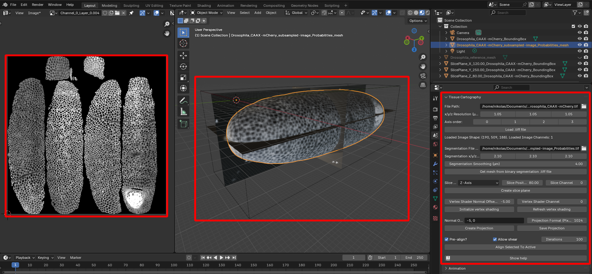
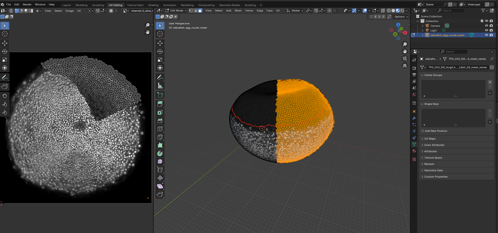

# blender-tissue-cartography

<!-- WARNING: THIS FILE WAS AUTOGENERATED! DO NOT EDIT! -->

## What this tool does

Tissue cartography extracts and cartographically projects surfaces from
volumetric image data. This turns your 3d data into 2d data which is
much easier to visualize, analyze, and computationally process. Tissue
cartography is particularly useful in developmental biology, analyzing
3d microscopy data by taking advantage of the laminar, sheet-like
organization of many biological tissues. For more detail, see [Heemskerk
& Streichan 2015](https://doi.org/10.1038/nmeth.3648) and [Mitchell &
Cislo 2023](https://doi.org/10.1038/s41592-023-02081-w).

`blender_tissue_cartography` is an add-on, a python package and a set of
template analysis pipelines/tutorials to do tissue cartography using the
popular 3d creation software [blender](https://www.blender.org/). The
goal is to make tissue cartography as user-friendly as possible using
simple, modular Python code and blender’s graphical user interface.

### Work in progress!

This project is a work in progress and may change rapidly.

## Installation

`blender_tissue_cartography` comprises both an add-on that allows you to
do tissue cartography purely graphically within Blender, as well as a
python library for custom and/or automatized pipelines.

### Blender add-on

1.  Install the non-python programs: [Fiji](https://fiji.sc/)
    (optional), [Ilastik](https://www.ilastik.org/),
    [Meshlab](https://www.meshlab.net/) (optional), and [Blender
    4.3](https://www.blender.org/).

2.  From the
    [GitHub](https://github.com/nikolas-claussen/blender-tissue-cartography),
    download the file
    `blender_tissue_cartography/blender_tissue_cartography_addon.py`.

3.  [Install the
    add-on](https://docs.blender.org/manual/en/latest/editors/preferences/addons.html):
    Click “Edit -\> Preferences -\> Add-ons -\> Add-on Settings -\>
    Install from disk” and select `blender_tissue_cartography_addon.py`.

4.  Restart Blender. The add-on can now be found under “Scene -\> Tissue
    Cartography”.

### Python library

1.  Install the non-python programs: [Fiji](https://fiji.sc/)
    (optional), [Ilastik](https://www.ilastik.org/),
    [Meshlab](https://www.meshlab.net/) (optional), and
    [Blender](https://www.blender.org/).

2.  Install Python via
    [anaconda/miniconda](https://docs.anaconda.com/miniconda/miniconda-install/),
    if you haven’t already.

3.  Install `blender_tissue_cartography`:

    - run `pip install blender-tissue-cartography` in a command window.

4.  (Optional) Install extra Python library for `pymeshlab`, required
    for some advanced (re)meshing functionality. This package is not
    available on new ARM Apple computers.

    - run `pip install pymeshlab` in a command window

The project is hosted on
[pip](https://pypi.org/project/blender-tissue-cartography/), with source
code on
[GitHub](https://github.com/nikolas-claussen/blender-tissue-cartography).

#### Developer installation

If you want to extend `blender_tissue_cartography`:

1.  [Clone](https://docs.github.com/en/repositories/creating-and-managing-repositories/cloning-a-repository)
    the [github
    repository](https://github.com/nikolas-claussen/blender-tissue-cartography).

2.  Create a `conda` environment with all Python dependencies and
    install the `blender_tissue_cartography` module. Open a command
    window in the `blender-tissue-cartography` directory and type:

    - `conda env create -n blender_tissue_cartography -f environment.yml`
    - `conda activate blender_tissue_cartography`
    - `pip install -e .`

3.  (Optional) Install extra Python library for `pymeshlab`, required
    for some advanced functionality (remeshing and surface
    reconstruction from within Python).

    - `pip install pymeshlab` - Note that this package is not available
      on new ARM Apple computers.

4.  Install [nbdev](https://nbdev.fast.ai/)

## Documentation

Full documentation (including tutorials) is available here:
https://nikolas-claussen.github.io/blender-tissue-cartography/

## Basic usage

For a complete set of tutorials, see the [documentation
website](https://nikolas-claussen.github.io/blender-tissue-cartography/).

### Tissue cartography workflow

Tissue cartography starts with a 3D, volumetric image.

1.  Create a segmentation of your 3D data to identify the surface you
    want to extract

2.  Convert the segmentation into a mesh of your surface of interest

3.  Cartographically unwrap the mesh into a 2D plane

4.  Project your 3D data onto the unwrapped mesh

5.  Visualize the results in 3D using blender or use the 2D projected
    data for quantitative analysis.

### Blender add-on

The Blender add-on allows you to carry out steps 2-5 entirely within
Blender. Here is a screenshot using the example *Drosophila* dataset:

Left: Projected 2D image. Center: 3D view of iamge data (volume bounding
box, image slices, and extracted surface). Right: Tissue Cartography
add-on panel.

In Blender, you can edit meshes and cartographic projections
interactively - you can create a preliminary projection of your data
automatically, and use it as guidance when editing your cartographic map
in blender. Here, we edit the “seam” of our cartographic map based on
the region occupied by cells during zebrafish epiboly (tutorial 6).

### Python library

For advanced users, the `blender_tissue_cartography` library allows
creating custom and automated tissue cartography pipelines, typically
run from a jupyter computational notebook (which can also serve as lab
notebook - notes, comments on the data). `blender_tissue_cartography`
also provides tools for correct quantitative analysis of image data on
curved surfaces.

Below is a screenshot to give you an idea of the workflow for the
example *Drosophila* dataset: Volumetric data in ImageJ (center),
jupyter computational notebook to run the `blender_tissue_cartography`
module (left), and blender project with extracted mesh and texture
(right).

### Tutorials

Fully worked-out tutoruals are provided on the [documentation
webpage](https://nikolas-claussen.github.io/blender-tissue-cartography/).
Test data for the tutorials can be downloaded from the [`nbs/Tutorials/`
directory](https://github.com/nikolas-claussen/blender-tissue-cartography/tree/main/nbs/Tutorials).

For the Python library, tutorials take the form of jupyter computational
notebooks which you can download and run on your own computer (click the
green button “Code” to download a `.zip`.) To run a tutorial on your
computer, follow the installation instructions and then [launch
jupyter](https://docs.jupyter.org/en/latest/running.html) and work
through the notebooks in the `Tutorials` directory in order. I
recommended being comfortable with running simple Python code (you don’t
have to do any coding yourself).

The tutorial notebooks can be used as *templates* for your own analysis
pipelines. Here is an example of a jupyter computational notebook
(left), and the created projection visualized in Blender (right).

#### Notes for Python beginners

- You will need a working Python installation (see here: [installing
  anaconda/miniconda](https://docs.anaconda.com/miniconda/miniconda-install/),
  and know how to [launch jupyter
  notebooks](https://docs.jupyter.org/en/latest/running.html). You will
  run the computational notebooks in your browser. Here is a [video
  tutorial](https://www.youtube.com/watch?v=HW29067qVWk)

- Create a new folder for each tissue cartography project. Do not place
  them into the folder into which you unpacked
  `blender_tissue_cartography` - otherwise, your files will be
  overwritten if you want to update the software

- The repository contains two sets of notebooks: in the `nbs` folder and
  in the `nbs/Tutorials` folder. The `nbs`-notebooks are for developing
  the code. If you don’t want to develop/adapt the code to your needs,
  you don’t need to look at them. Copy a notebook from the
  `nbs/Tutorials` folder - e.g. `03_basics_example.ipynb` - into your
  project folder to use it as a template.

- You do not need to copy functions into your notebooks manually. If you
  follow the installation instructions, the code will be installed as a
  Python package and can be “imported” by Python. See tutorials!

### Dynamic datasets

`blender_tissue_cartography` also allows creating cartographic
projections of dynamic datasets (i.e. movies), where the surface of
interest can move or deform over time. The user creates a cartographic
projection for a *reference timepoint* which is transfered to all other
time-points using surface-to-surface registration algorithms. This
generates consistent projections across all timepoints - see tuorials
[8](https://nikolas-claussen.github.io/blender-tissue-cartography/Tutorials/08_multiple_recordings_and_reference_meshes.html)
and
[9](https://nikolas-claussen.github.io/blender-tissue-cartography/Tutorials/09_movies_and_dynamic_surfaces.html).

## Software stack

Note: the Python libraries will be installed automatically if you follow
the installation instructions above.

### Required

- Python, with the following libraries
  - [jupyter](https://jupyter.org/)
  - [numpy](https://numpy.org/) / [Matplotlib](https://matplotlib.org/)
    / [Scipy](https://scipy.org/)
  - [skimage](https://scikit-image.org) various image processing tools.
  - [h5py](https://www.h5py.org/) for reading/writing of `.h5` files.
  - [tifffile](https://github.com/cgohlke/tifffile/) for reading/writing
    of `.tif` files, including metadata.
  - [libigl](https://libigl.github.io/libigl-python-bindings) Geometry
    processing.
- [Ilastik](https://www.ilastik.org/) Image classification and
  segmentation,
- [Blender](https://www.blender.org/) Mesh editing and UV mapping.

### Optional

- [Meshlab](https://www.meshlab.net/) GUI and Python library with
  advanced surface reconstruction tools (required for some workflows).

- Python libraries:

  - [PyMeshLab](https://pymeshlab.readthedocs.io/en/latest/index.html)
    Python interface to MeshLab.
  - [nbdev](https://nbdev.fast.ai/tutorials/tutorial.html) for
    notebook-based development, if you want to add your own code

### Other useful software

- [MicroscopyNodes](https://github.com/oanegros/MicroscopyNodes) plug-in
  for rendering volumetric `.tif` files in blender
- [Boundary First
  Flattening](https://github.com/GeometryCollective/boundary-first-flattening)
  advanced tool for creating UV maps with graphical and command line
  interface
- [pyFM](https://github.com/RobinMagnet/pyFM) python library for
  mesh-to-mesh registration (for dynamic data) which may complement the
  algorithms that ship with `blender_tissue-cartography`

## Acknowledgements

This software is being developed by Nikolas Claussen in the [Streichan
lab at UCSB](https://streichanlab.physics.ucsb.edu/). We thank Susan
Wopat, Matthew Lefebvre, Sean Komura, Gary Han, Noah Mitchel, Boris
Fosso, and Dillon Cislo, for sharing data, advice, and software testing.
